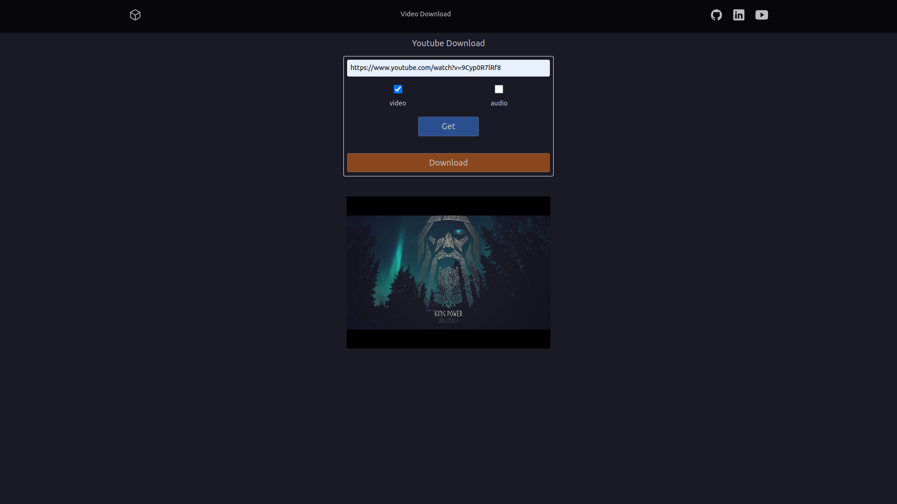

    
        

# TOOLBOX
Personal Project - Website with various tools created with Python-Django

 

## About
The intention for this project will be to build a website with useful tools for everyday life.

 

    
Video Download

     

