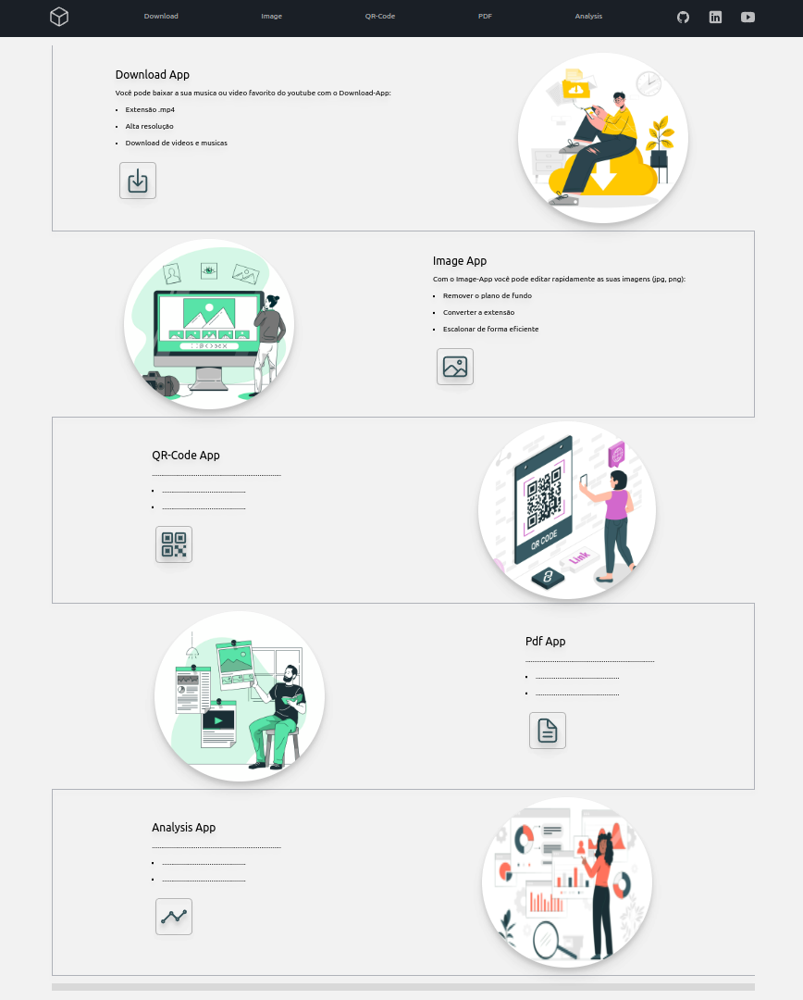
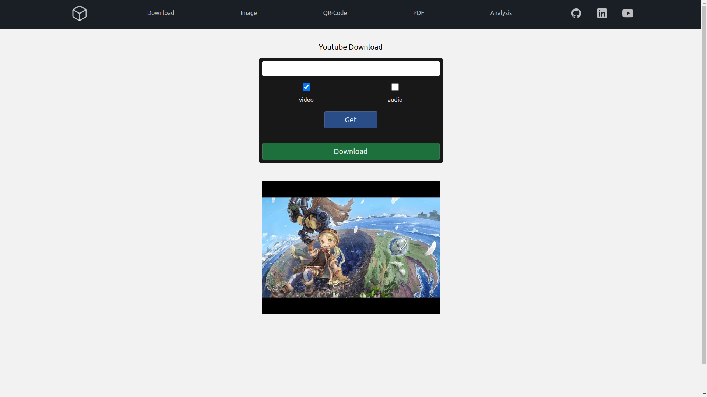

<div align="center">
    
    
          
</div>

<br>

# TOOLBOX -> [**link**](https://my--toolbox.herokuapp.com/)

- Projeto pessoal - Website com varias funcionalidades, desenvolvido com Python-Django 

- Personal Project - Website with various tools created with Python-Django


## About

- A intenção do projeto será agregar diferentes ferramentas utéis para o dia a dia. 

- The intention for this project will be to build a website with useful tools for everyday life.


## Dependencies

> - **obs:** Este projeto usa diferentes modulos de terceiros, use a versão do requirements.txt
> - **obs:** This project uses different third-party modules, so use the requirements.txt version

- pytube==12.1.0
- rembg==2.0.25

## Functionalities


- **Download from youtube:**
    - [x] High resolution video .mp4
    - [x] Audio .mp4
- **Image Treatment:** 
    - [ ] Remove Background
    - [ ] Save in high resolution
    - [ ] Resize
    - [ ] Save in .png and .jpg

## Start the project

Clone this project
```console
git clone https://github.com/Fernando-Medeiros/Toolbox.git
```

Create the virtual environment
```console
virtualenv .venv
```

Activate .venv
```console
# Linux
source .venv/bin/activate
# Windows Power Shell
./.venv/bin/activate.ps1
```

Install dependencies
```console
pip install -r requirements.txt
```

Start the game
```console
python manage.py runserver
```


## Structure

```console
.
├── docs
│   ├── img
│   └── README.md
├── downloadApp
│   ├── apps.py
│   ├── forms.py
│   ├── __init__.py
│   ├── templates
│   │   └── download-home.html
│   ├── urls.py
│   └── views.py
├── imageApp
│   ├── apps.py
│   ├── __init__.py
│   ├── templates
│   │   └── image-home.html
│   ├── urls.py
│   └── views.py
├── LICENSE
├── manage.py
├── Procfile
├── requirements.txt
├── runtime.txt
├── static
│   ├── images
│   │   ├── imageapp-License free.txt
│   │   └── pdfapp-License free.txt
│   ├── js
│   │   └── navbar.js
│   └── video
├── templates
│   ├── base.html
│   ├── footer.html
│   ├── homepage.html
│   └── navbar.html
└── TOOLBOX
    ├── asgi.py
    ├── __init__.py
    ├── settings.py
    ├── urls.py
    └── wsgi.p
```

## Project

### HomePage
<div align="center">
    
</div>

### Youtube Download
<div align="center">    
    
</div>